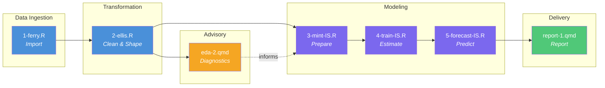

# Alberta Income Support: Caseload Forecast

**End-to-end forecasting pipeline — from open data to 24-month projections.**

This repository implements a complete monthly caseload forecasting system for Alberta's [Income Support](https://open.alberta.ca/opendata/income-support-aggregated-caseload-data) program. It ingests publicly available Government of Alberta data (April 2005 – September 2025, ~50,000 rows), transforms it through a six-stage reproducible pipeline, and produces a static HTML report with 24-month ARIMA forecasts and prediction intervals. The entire pipeline runs on-premises with a single command (`Rscript flow.R`) and is designed as the **cloud-agnostic core** for subsequent migration to Azure ML and Snowflake.

---

## At a Glance

| Parameter | Value |
|:---|:---|
| **Data Source** | [Alberta Open Data – Income Support Caseload](https://open.alberta.ca/opendata/income-support-aggregated-caseload-data) |
| **Temporal Coverage** | April 2005 – September 2025 (246 months) |
| **Focal Date** | `2025-09-01` (last month with observed data) |
| **Forecast Horizon** | 24 months (October 2025 – September 2027) |
| **Primary Model** | ARIMA(3,1,1)(1,0,0)\[12\] with log transform |
| **Baseline Model** | Seasonal Naïve (Tier 1) |
| **Output** | Static HTML report with forecasts + 95% prediction intervals |
| **Reproduce** | `Rscript flow.R` |

---

## Pipeline Architecture

The system follows a **Ferry → Ellis → Mint → Train → Forecast → Report** pattern, adapted from [RAnalysisSkeleton](https://github.com/wibeasley/RAnalysisSkeleton). Each stage is a self-contained R script orchestrated by [`flow.R`](flow.R).



### Pipeline Stages

| # | Stage | Script | Role | Key Output |
|:--|:------|:-------|:-----|:-----------|
| 1 | **Ferry** | `1-ferry.R` | Import raw data from 4 equivalent sources (URL, CSV, SQLite, SQL Server) | Staging SQLite database |
| 2 | **Ellis** | `2-ellis.R` | Transform raw data into 11 analysis-ready tables (wide + long) | Parquet files + SQLite + [CACHE-manifest](data-public/metadata/CACHE-manifest.md) |
| — | **EDA** | `eda-2.qmd` | Advisory — trend, seasonality, stationarity diagnostics | Quarto HTML report (not in pipeline flow) |
| 3 | **Mint** | `3-mint-IS.R` | Train/test split, log transform, regressor matrices | `forge/` Parquet slices + `forge_manifest.yml` |
| 4 | **Train** | `4-train-IS.R` | Fit Tier 1 (Seasonal Naïve) and Tier 2 (ARIMA) models | Model `.rds` objects + `model_registry.csv` |
| 5 | **Forecast** | `5-forecast-IS.R` | Generate 24-month projections + backtest diagnostics | Forecast CSVs + `forecast_manifest.yml` |
| 6 | **Report** | `report-1.qmd` | Assemble final HTML deliverable | `report-1.html` |

**Lineage**: A `forge_hash` in `forge_manifest.yml` links every model and forecast back to the exact data slice that produced it. Changing the `focal_date` in [`config.yml`](config.yml) invalidates all Mint/Train/Forecast artifacts downstream.

**Dual format**: Ellis outputs both **Apache Parquet** (primary — fast, columnar, cloud-ready) and **SQLite** (secondary — SQL exploration, portability).

See [`manipulation/pipeline.md`](manipulation/pipeline.md) for full technical documentation.

---

## Reports & Exploratory Analysis

### Forecast Report

The final deliverable: **24-month forward projections** for Alberta Income Support caseload (October 2025 – September 2027).

Includes executive summary, hero forecast chart, model comparison (Seasonal Naïve vs ARIMA), backtest validation against a held-out 24-month window, policy implications, and full data provenance.

<p align="center">
  
  <br/><sub>20-year history + 24-month ARIMA projection with 80%/95% prediction intervals</sub>
</p>

<p align="center">
  
  <br/><sub>Backtest evidence — actual vs. fitted on held-out 24-month window</sub>
</p>

> **Output**: [`analysis/report-1/report-1.html`](analysis/report-1/) · Generated as Lane 6 of `flow.R`

### Exploratory Data Analysis (EDA)

The EDA report ([`eda-2.qmd`](analysis/eda-2/)) runs outside the pipeline as an advisory step. It diagnoses the time series properties that inform modeling decisions in Mint and Train.

**Coverage**: 20-year trends · client type composition · 7 historical periods (2008 crisis, oil collapse, COVID-19, recovery) · year-over-year seasonality · growth rates · stationarity tests (ADF, KPSS) · ACF/PACF for ARIMA order selection · STL decomposition · log transform assessment.

<p align="center">
  
  <br/><sub>Total caseload — 20 years of monthly Income Support data annotated with historical periods</sub>
</p>

<p align="center">
  
  <br/><sub>Train/test partition used for backtest evaluation</sub>
</p>

<p align="center">
  
  <br/><sub>STL seasonal decomposition — trend, seasonal, and remainder components</sub>
</p>

> **Output**: [`analysis/eda-2/eda-2.html`](analysis/eda-2/) · Run manually, not part of `flow.R`

---

## Data

**Source**: [Alberta Open Data](https://open.alberta.ca/opendata/income-support-aggregated-caseload-data) — monthly aggregates of Income Support caseload, intakes, and exits by geography and demographics.

Ellis transforms the raw data into **11 analysis-ready tables**:

| Dimension | Wide | Long | Coverage |
|:----------|:----:|:----:|:---------|
| **Total Caseload** | 246 rows | — | Apr 2005 – Sep 2025 |
| **Client Type** | 162 | 648 | Apr 2012 – Sep 2025 |
| **Family Composition** | 162 | 648 | Apr 2012 – Sep 2025 |
| **Regions** | 90 | 720 | Apr 2018 – Sep 2025 |
| **Age Groups** | 66 | 990 | Apr 2020 – Sep 2025 |
| **Gender** | 66 | 198 | Apr 2020 – Sep 2025 |

Dimensional availability expanded over five historical phases as the Government of Alberta added breakdowns to the published dataset.

See [`data-public/metadata/CACHE-manifest.md`](data-public/metadata/CACHE-manifest.md) for table schemas and row counts.

---

## Cloud Migration Roadmap

This repository is the **cloud-agnostic on-premises core**. It establishes a fully functional forecasting pipeline that can be extended to cloud ML platforms through provider-specific forks.

### Phase 1 — On-Premises (Current)

All six pipeline stages execute end-to-end on a local workstation. Reproduction requires only R, Quarto, and `Rscript flow.R`. Outputs are static HTML reports suitable for manual distribution or SharePoint hosting.

### Phase 2 — Cloud ML Platforms (Planned)

| Capability | Azure ML (primary) | Snowflake ML (secondary) |
|:-----------|:-------------------|:-------------------------|
| **Compute** | Azure ML Compute Instances | Snowflake Warehouses |
| **Pipeline Orchestration** | Azure ML Pipelines | Snowflake Tasks |
| **Model Registry** | Azure ML Model Registry + MLflow | Snowflake Model Registry |
| **Experiment Tracking** | MLflow | Snowflake ML |
| **Report Delivery** | Cloud-hosted app with Entra ID auth | Streamlit in Snowflake |
| **Scheduling** | Azure ML scheduled runs | Snowflake Tasks (cron) |
| **Fork Repository** | `caseload-forecast-demo-azure` | `caseload-forecast-demo-snowflake` |

### What Stays / What Changes

| Stays On-Prem (R) | Migrates to Cloud |
|:-------------------|:------------------|
| Data wrangling (Ferry, Ellis) | Pipeline orchestration (flow.R → cloud scheduler) |
| EDA diagnostics | Model training (if Python SDK integration is smoother) |
| Domain logic & config | Model registry & experiment tracking |
| | Report hosting & access control |
| | Monthly automated refresh |

### Design-for-Portability Decisions

- **Apache Parquet** artifacts — columnar, cross-platform, cloud-native
- **Modular pipeline stages** — each script is a self-contained step
- **Config-driven paths** — all parameters in [`config.yml`](config.yml), no hardcoded values
- **Forge manifest** — versioned data contract linking Mint → Train → Forecast
- **Deterministic seeds** — reproducible results across environments

> The companion workspace [`azure-aml-demo/`](../azure-aml-demo/) contains a read-only Azure ML reference project with notebooks for data exploration, feature engineering, training pipelines, and deployment.

---

## Reproduce the Pipeline

### Prerequisites

- [R (4.0+)](https://cran.r-project.org/) · [Quarto](https://quarto.org/) · [Git](https://git-scm.com/)
- [VS Code](https://code.visualstudio.com/) or [RStudio](https://rstudio.com/products/rstudio/)

### Run

```bash
git clone https://github.com/andkov/caseload-forecast-demo.git
cd caseload-forecast-demo
Rscript flow.R
```

This executes all pipeline stages in order and produces `analysis/report-1/report-1.html`.

### Install R Dependencies

Choose one approach (see [`guides/environment-management.md`](guides/environment-management.md) for details):

| Approach | Command | Best For |
|:---------|:--------|:---------|
| **CSV System** (default) | `Rscript utility/install-packages.R` | Day-to-day development |
| **renv** | `Rscript utility/init-renv.R` | Exact reproducibility |
| **Conda** | `conda env create -f environment.yml` | R + Python workflows |

### Configuration

All pipeline parameters live in [`config.yml`](config.yml): focal date, forecast horizon, model settings, directory paths, and database connections. Changing `focal_date` triggers a full re-run of Mint → Train → Forecast.

---

## Repository Structure

```
caseload-forecast-demo/
├── flow.R                  # Pipeline orchestrator — single entry point
├── config.yml              # All pipeline parameters
├── manipulation/           # Pipeline scripts (1-ferry → 5-forecast)
│   ├── 1-ferry.R           #   Data import from 4 equivalent sources
│   ├── 2-ellis.R           #   Transform to 11 analysis-ready tables
│   ├── 3-mint-IS.R         #   Model-ready data preparation
│   ├── 4-train-IS.R        #   Model estimation (Naïve + ARIMA)
│   ├── 5-forecast-IS.R     #   24-month projections + backtest
│   └── pipeline.md         #   Full pipeline documentation
├── analysis/               # Reports and exploratory analysis
│   ├── eda-2/              #   EDA: trends, seasonality, stationarity
│   └── report-1/           #   Final forecast report (HTML)
├── data-public/            # Open data, metadata, manifests
├── data-private/           # Derived artifacts (gitignored)
├── scripts/                # Shared functions and graphing utilities
├── guides/                 # Documentation and how-to guides
├── ai/                     # AI support system (personas, memory)
└── philosophy/             # Research methodology (FIDES framework)
```

---

## AI Support

This project includes a persona-based AI support system with 9 specialized roles: Developer, Project Manager, Research Scientist, Prompt Engineer, Data Engineer, Grapher, Reporter, DevOps Engineer, and Frontend Architect. Context is managed dynamically via VS Code tasks (`Ctrl+Shift+P` → "Tasks: Run Task" → "Activate [Persona] Persona"). See [`ai/README.md`](ai/README.md) for full documentation.

---

## Additional Resources

- [`manipulation/pipeline.md`](manipulation/pipeline.md) — Full pipeline architecture and data flow documentation
- [`guides/getting-started.md`](guides/getting-started.md) — Extended setup walkthrough
- [`guides/flow-usage.md`](guides/flow-usage.md) — How `flow.R` orchestration works
- [`data-public/metadata/CACHE-manifest.md`](data-public/metadata/CACHE-manifest.md) — Ellis output table schemas
- [`philosophy/`](philosophy/) — FIDES research methodology framework
- [RAnalysisSkeleton](https://github.com/wibeasley/RAnalysisSkeleton) — Foundational reproducible research patterns

---

*Licensed under [MIT](LICENSE).*
