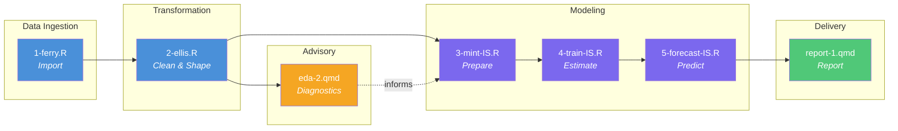

# Pipeline Execution Guide

**Purpose**: Authoritative technical reference for the six-stage reproducible pipeline that transforms raw Alberta Income Support open data into 24-month caseload forecasts.

**Last Updated**: 2026-02-23

---

## Overview

This document complements the architecture summary in the [main README](../README.md) with full input/output specifications, transformation rules, and lineage documentation for each lane. Scripts are organised into two categories:

1. **Non-Flow Scripts**: One-time setup or ad-hoc operations (`./manipulation/nonflow/`)
2. **Flow Scripts**: Reproducible pipeline steps orchestrated by `./flow.R`

---

## Pipeline Architecture

The system follows a **Ferry → Ellis → Mint → Train → Forecast → Report** pattern, adapted from [RAnalysisSkeleton](https://github.com/wibeasley/RAnalysisSkeleton). Each stage is a self-contained R/Quarto script orchestrated by [`flow.R`](../flow.R).



### Pipeline Stages

| # | Stage | Script | Role | Key Output |
|:--|:------|:-------|:-----|:-----------|
| 1 | **Ferry** | `1-ferry.R` | Import raw data from 4 equivalent sources (URL, CSV, SQLite, SQL Server) | Staging SQLite database |
| 2 | **Ellis** | `2-ellis.R` | Transform raw data into 11 analysis-ready tables (wide + long) | Parquet files + SQLite + [CACHE-manifest](../data-public/metadata/CACHE-manifest.md) |
| — | **EDA** | `eda-2.qmd` | Advisory — trend, seasonality, stationarity diagnostics | Quarto HTML report (not in pipeline flow) |
| 3 | **Mint** | `3-mint-IS.R` | Train/test split, log transform, regressor matrices | `forge/` Parquet slices + `forge_manifest.yml` |
| 4 | **Train** | `4-train-IS.R` | Fit Tier 1 (Seasonal Naïve) and Tier 2 (ARIMA) models | Model `.rds` objects + `model_registry.csv` |
| 5 | **Forecast** | `5-forecast-IS.R` | Generate 24-month projections + backtest diagnostics | Forecast CSVs + `forecast_manifest.yml` |
| 6 | **Report** | `report-1.qmd` | Assemble final HTML deliverable | `report-1.html` |

**Lineage**: A `forge_hash` in `forge_manifest.yml` links every model and forecast back to the exact data slice that produced it. Changing `focal_date` in [`config.yml`](../config.yml) invalidates all Mint/Train/Forecast artifacts downstream.

**Dual format**: Ellis outputs both **Apache Parquet** (primary — fast, columnar, cloud-ready) and **SQLite** (secondary — SQL exploration, portability).

## Execution Philosophy

### To Execute This Project: Run `./flow.R`

The single command that reproduces all project outputs:

```r
source("./flow.R")
```

Or from terminal:

```bash
Rscript flow.R
```

**What Happens**: The `flow.R` script executes all pipeline steps defined in the `ds_rail` tibble in sequential order, handling:
- Data import (ferry lanes)
- Data transformation (ellis lanes)
- Model preparation, training, and forecasting (mint / train / forecast lanes)
- Report generation (Quarto documents)
- Error logging and validation

### Non-Flow Scripts: Setup and Experimentation

Scripts in `./manipulation/nonflow/` serve supporting roles:
- **Setup**: Prepare data assets or infrastructure (e.g., `create-data-assets.R`)
- **Examples**: Demonstrate patterns (e.g., `ferry-lane-example.R`, `ellis-lane-example.R`)
- **Inspection**: Ad-hoc data exploration (e.g., `inspect-forge.R`)
- **Testing**: Validate pipeline artifacts (e.g., `test-ellis-cache.R`)

These scripts are documented here for understanding but are **not part of the reproducible pipeline**.

---

## Non-Flow Scripts

### `create-data-assets.R`

**Category**: One-Time Setup  
**Status**: Run before first pipeline execution  
**Purpose**: Prepare test data sources for multi-source ferry pattern demonstration

#### What It Does

Creates two data assets from the Open Alberta CSV file to enable testing of the multi-source ferry pattern (`1-ferry.R`):

1. **SQLite database**: `./data-public/raw/open-data-is-sep-2025.sqlite`
   - Table: `open_data_is_sep_2025`
   - Contents: Income Support aggregated data (April 2005 - Sept 2025)

2. **SQL Server table**: `RESEARCH_PROJECT_CACHE_UAT.AMLdemo.open_data_is_sep_2025`
   - Location: Remote database via ODBC
   - Contents: Identical to SQLite (for source comparison testing)

#### Execution Flow

```
create-data-assets.R Workflow
═════════════════════════════════════════════════════════════════

INPUT:
  ./data-public/raw/is-aggregated-data-april-2005-sep-2025.csv
                              │
                              ▼
                    ┌──────────────────┐
                    │  Load CSV Data   │
                    │  • Skip title    │
                    │  • Clean names   │
                    │  • Select cols   │
                    └────────┬─────────┘
                             │
              ┌──────────────┴──────────────┐
              │                             │
              ▼                             ▼
    ┌──────────────────┐         ┌──────────────────┐
    │  Write to SQLite │         │ Write to SQL Svr │
    │  • Local file    │         │ • Remote ODBC    │
    │  • Fast access   │         │ • Enterprise DB  │
    └────────┬─────────┘         └────────┬─────────┘
             │                            │
             ▼                            ▼
    ┌──────────────────┐         ┌──────────────────┐
    │ open-data-is-    │         │ (DSN).AMLdemo.   │
    │ sep-2025.sqlite  │         │ open_data_is_... │
    └──────────────────┘         └──────────────────┘

OUTPUTS:
  ✓ SQLite:     ./data-public/raw/open-data-is-sep-2025.sqlite
  ✓ SQL Server: RESEARCH_PROJECT_CACHE_UAT.AMLdemo.open_data_is_sep_2025
  ✓ Validation: Row count verification across all sources
```

#### When to Run

- **Initial setup**: Before first execution of `1-ferry.R`
- **Data refresh**: When Open Alberta updates the source CSV
- **Testing**: To reset data assets to known good state

#### Dependencies

```r
library(magrittr); library(dplyr); library(readr)
library(janitor); library(DBI); library(RSQLite); library(odbc)
# Requires: ODBC DSN "RESEARCH_PROJECT_CACHE_UAT", SQL Server schema AMLdemo
```

#### Validation

The script performs automatic validation:
- **Dimension check**: All sources have identical row/column counts
- **Column check**: Verify consistent column names
- **Row count**: Confirm matching record counts after write

Success message:
```
✅ VALIDATION PASSED: All tables have identical row counts
```

#### Why This Is Non-Flow

This script is **infrastructure setup**, not reproducible analysis:
- Run once to establish data assets
- Not needed on every pipeline execution
- Creates resources that ferry lanes consume

---

### `ferry-lane-example.R` and `ellis-lane-example.R`

**Category**: Pattern Examples  
**Status**: Educational reference  
**Purpose**: Demonstrate ferry and ellis pattern implementation using `mtcars`

See [Pattern Philosophy](README.md#ferry-and-ellis-patterns-philosophy-and-implementation-guide) for detailed documentation.

---

### `inspect-forge.R`

**Category**: Inspection / Debug  
**Status**: Ad-hoc  
**Purpose**: Inspect `forge/` Parquet artifacts produced by the Mint lane — useful for verifying train/test splits, column schemas, and data integrity before committing a Mint run to the Train lane.

---

### `test-ellis-cache.R`

**Category**: Validation  
**Status**: Runnable as a VS Code task ("Test Ellis ↔ CACHE-Manifest Alignment")  
**Purpose**: Verify that `data-public/metadata/CACHE-manifest.md` accurately describes the artifacts produced by `2-ellis.R`. Fails loudly if schemas, row counts, or table names drift.

---

## Flow Scripts

Scripts listed in the `ds_rail` tibble within `./flow.R` constitute the **reproducible pipeline**. These are executed in order when running `source("./flow.R")`.

### Current Pipeline Configuration

```r
# From flow.R — ds_rail definition (as of 2026-02-23)
ds_rail  <- tibble::tribble(
  ~fx         , ~path,

  # PHASE 1: FERRY
  "run_r"     , "manipulation/1-ferry.R",

  # PHASE 2: ELLIS
  "run_r"     , "manipulation/2-ellis.R",

  # PHASE 3: MINT
  "run_r"     , "manipulation/3-mint-IS.R",

  # PHASE 4: TRAIN
  "run_r"     , "manipulation/4-train-IS.R",

  # PHASE 5: FORECAST
  "run_r"     , "manipulation/5-forecast-IS.R",

  # PHASE 6: REPORT
  "run_qmd"   , "analysis/report-1/report-1.qmd",
)
```

---

### Lane 1 — `1-ferry.R` — Multi-Source Data Transport

**Phase**: Data Import & Preparation  
**Pattern**: Ferry (Zero semantic transformation)  
**Status**: Active in pipeline  
**Execution time**: ~10–30 seconds (URL source; < 5 s for local sources)

#### Purpose

Demonstrate and validate that Income Support open data can be loaded from **four equivalent sources**, establishing source interchangeability for flexible deployment:

1. **URL**: Open Alberta API endpoint (production source)
2. **CSV**: Local cached file (offline development)
3. **SQLite**: Local database (fast access, version control friendly)
4. **SQL Server**: Enterprise database (production alternative)

#### Ferry Pattern Implementation

```
1-ferry.R: Multi-Source Data Transport
═════════════════════════════════════════════════════════════════

SOURCES (4 Equivalent Sources):

┌────────────────────┐
│   1. URL Source    │  Open Alberta API
│  (Internet)        │  https://open.alberta.ca/.../is-aggregated...
└──────────┬─────────┘
           │
           ▼ load_from_url()
┌────────────────────┐
│  ds_url            │  read_csv(url)
└──────────┬─────────┘
           │
           │
┌────────────────────┐
│   2. CSV Source    │  Local cache
│  (File)            │  ./data-public/raw/is-aggregated-data...
└──────────┬─────────┘
           │
           ▼ load_from_csv()
┌────────────────────┐
│  ds_csv            │  read_csv(path)
└──────────┬─────────┘
           │
           │
┌────────────────────┐
│  3. SQLite Source  │  Local database
│  (Database)        │  ./data-public/raw/open-data-is-sep-2025.sqlite
└──────────┬─────────┘
           │
           ▼ load_from_sqlite()
┌────────────────────┐
│  ds_sqlite         │  DBI::dbConnect(SQLite)
└──────────┬─────────┘
           │
           │
┌────────────────────┐
│ 4. SQL Server Src  │  Remote enterprise database
│  (ODBC)            │  RESEARCH_PROJECT_CACHE_UAT
└──────────┬─────────┘
           │
           ▼ load_from_sqlserver()
┌────────────────────┐
│  ds_sqlserver      │  DBI::dbConnect(odbc)
└──────────┬─────────┘
           │
           │
           ▼ validate_identity()
┌────────────────────────────────────────┐
│  VALIDATION CHECKS:                    │
│  ✓ Dimensions identical                │
│  ✓ Column names identical              │
│  ✓ Row-by-row data identical           │
│  ✓ Source interchangeability confirmed │
└──────────────────┬─────────────────────┘
                   │
                   ▼ save_to_output()
┌────────────────────────────────────────┐
│  OUTPUT (Staging):                     │
│  ./data-private/derived/               │
│    open-data-is-1.sqlite               │
│                                        │
│  Table: open_data_is_raw               │
│  Rows: ~50,000 (varies by data date)   │
│  Cols: 5 (ref_date, geography,         │
│           measure_type, measure, value)│
└────────────────────────────────────────┘
```

#### Transformations Applied

**Permitted** (technical transport only):
- Column name cleaning: `janitor::clean_names()` (spaces → underscores, lowercase)
- Column selection: Keep only 5 essential columns
- Skip header row: `skip = 1` (Open Alberta CSV has title row)

**Forbidden** (ferry principle):
- No factor recoding
- No value transformation
- No derived variables
- No filtering or aggregation

#### Output

**File**: `./data-private/derived/open-data-is-1.sqlite`  
**Table**: `open_data_is_raw`  
**Schema**:
```
ref_date       chr   "2005-04", "2005-05", ... (YY-Mon format)
geography      chr   "Alberta", "Calgary", "Edmonton", ...
measure_type   chr   "Active clients", "Intake", "Exits"
measure        chr   "Persons", "Case count", "Benefit units"
value          chr   "1234", "567", ... (numbers as strings, may have commas)
```

**Note**: This is **raw staging data**. The Ellis lane (`2-ellis.R`) will parse dates, convert values to numeric, recode factors to project taxonomy, and pivot to wide analysis-ready tables.

#### Validation Output

```bash
=== VALIDATING SOURCE IDENTITY ===

Dimensions:
      URL     CSV  SQLite SQLServer 
"50000 × 5" "50000 × 5" "50000 × 5" "50000 × 5"

✓ All sources have identical dimensions
✓ All sources have identical column names
✓ All sources produce identical datasets
✓ Sources are interchangeable
```

---

### Lane 2 — `2-ellis.R` — Raw-to-Analysis Transformation

**Phase**: Data Transformation  
**Pattern**: Ellis (Semantic transformation — first and only place raw data is reshaped)  
**Status**: Active in pipeline  
**Execution time**: ~5–15 seconds

#### Purpose

Transform the raw 5-column staging data produced by the ferry lane into **six tidy wide-format tables** and one long-format companion for each, covering every demographic breakdown published in the open data. All downstream lanes (Mint, Train, Forecast, Report) consume Ellis output exclusively — they never touch the raw staging database.

#### Execution Flow

```
2-ellis.R: Raw-to-Analysis Transformation
═══════════════════════════════════════════════════════════════

INPUT:
  ./data-private/derived/open-data-is-1.sqlite
    table: open_data_is_raw  (~50,000 rows × 5 cols)
                             │
             ┌───────────────┼─────────────────────┐
             │  Step 1: Date parsing                 │
             │    ref_date "05-Apr" → date 2005-04-01│
             │    + year, month, fiscal_year, label  │
             │               │                       │
             │  Step 2: Value cleaning               │
             │    Remove commas, convert to numeric  │
             │    Suppressed "-" → NA                │
             │               │                       │
             │  Step 3: Factor recoding              │
             │    measure_type → ordered factor      │
             │    measure     → cleaned labels       │
             │               │                       │
             │  Step 4: Pivot to wide format         │
             │    One row per date, cols = measures  │
             └───────────────┼─────────────────────┘
                             │
          ┌─────────────────┼──────────────────────────┐
          │                  │                           │
          ▼                  ▼                           ▼
  (6 wide tables)     (6 long tables)            Companion files
  total_caseload      total_caseload_long         CACHE-manifest.md
  client_type         client_type_long
  family_composition  family_composition_long
  regions             regions_long
  age_groups          age_groups_long
  gender              gender_long

OUTPUT (dual format):
  PRIMARY:   ./data-private/derived/open-data-is-2-tables/  (Parquet)
  SECONDARY: ./data-private/derived/open-data-is-2.sqlite   (SQLite)
  METADATA:  ./data-public/metadata/CACHE-manifest.md
```

#### Transformations Applied

| Step | Operation | Rationale |
|:-----|:----------|:----------|
| Date parsing | `"05-Apr"` → `Date`, derive `year`, `month`, `fiscal_year`, `month_label` | Domain calendar needed by all downstream lanes |
| Value cleaning | Strip commas, convert to `numeric`, suppressed `"-"` → `NA` | Open Alberta publishes numbers as character strings |
| Factor recoding | `measure_type` → ordered factor; abbreviate long measure labels | Consistent taxonomy across all downstream analyses |
| Wide pivot | Five demographic breakdowns pivoted from long → wide | One row per date is the canonical analytical shape |
| Long companion | Retain long format per table | Required for ggplot faceting and stacked charts |

#### Output Tables

| Table | Rows | Coverage |
|:------|-----:|:---------|
| `total_caseload` | 246 | Apr 2005 – Sep 2025 |
| `client_type` | 162 | Apr 2012 – Sep 2025 |
| `family_composition` | 162 | Apr 2012 – Sep 2025 |
| `regions` | 90 | Apr 2018 – Sep 2025 |
| `age_groups` | 66 | Apr 2020 – Sep 2025 |
| `gender` | 66 | Apr 2020 – Sep 2025 |

Each table includes date keys: `date`, `year`, `month`, `fiscal_year`, `month_label`, plus all dimension-specific measure columns.

See [`data-public/metadata/CACHE-manifest.md`](../data-public/metadata/CACHE-manifest.md) for full column schemas and row counts.

#### Dual Output Format

```
Parquet (primary)   data-private/derived/open-data-is-2-tables/
  total_caseload.parquet          total_caseload_long.parquet
  client_type_wide.parquet        client_type_long.parquet
  family_composition_wide.parquet family_composition_long.parquet
  regions_wide.parquet            regions_long.parquet
  age_groups_wide.parquet         age_groups_long.parquet
  gender_wide.parquet             gender_long.parquet

SQLite (secondary)  data-private/derived/open-data-is-2.sqlite
  (same 12 tables — SQL exploration and portability)
```

---

### Lane 3 — `3-mint-IS.R` — Model-Ready Data Preparation

**Phase**: Modeling (Preparation)  
**Pattern**: Mint (Prepares data slices consumed by ALL model tiers)  
**Status**: Active in pipeline  
**Execution time**: ~5 seconds

#### Purpose

Codify every analytical decision made during EDA into a versioned, reproducible artifact set that all model tiers consume. The Mint lane is the **single source of truth** for train/test split boundaries, log-transform decisions, and regressor matrices. Train and Forecast lanes never re-derive these — they load the Parquet slices and reconstruct time-series objects from them.

#### EDA Decision Log (codified from `analysis/eda-2/`)

| ID | Decision | Evidence |
|:---|:---------|:---------|
| EDA-001 | Log transform: `TRUE` | `eda-2` g12 — variance stabilisation |
| EDA-002 | Differencing: `d = 1` expected | `eda-2` g8 — stationarity tests (ADF, KPSS) |
| EDA-003 | Seasonal period: 12 | Monthly data, Alberta fiscal year cycle |
| EDA-004 | 24-month backtest window | `eda-2` g7 — train/test split visualisation |
| EDA-005 | Wide prediction intervals expected | `eda-2` g11 — STL decomposition |

#### Input

| Source | File | Description |
|:-------|:-----|:------------|
| Ellis output | `open-data-is-2-tables/total_caseload.parquet` | 246-month full series |
| Ellis output | `open-data-is-2-tables/client_type_wide.parquet` | Client-type composition fractions (xreg Tier 3) |
| Config | `config.yml` | `focal_date`, `backtest_months`, transform flags |

#### Output

All artifacts written to `./data-private/derived/forge/`:

| File | Description |
|:-----|:------------|
| `ds_train.parquet` | Train slice: Apr 2005 – Sep 2023 (222 months) — `date`, `year`, `month`, `caseload`, `y` |
| `ds_test.parquet` | Test slice: Oct 2023 – Sep 2025 (24 months) |
| `ds_full.parquet` | Full 246-month series (train + test combined) |
| `xreg_train.parquet` | Static exogenous regressors, train slice (client-type proportions) |
| `xreg_test.parquet` | Static exogenous regressors, test slice |
| `xreg_full.parquet` | Static exogenous regressors, full series |
| `xreg_future.parquet` | Static exogenous regressors, 24-month forecast horizon |
| `xreg_dynamic_*.parquet` | Tier 4 placeholder — 0-row schema (dynamic xreg not yet implemented) |
| `forge_manifest.yml` | Data contract: `focal_date`, `forge_hash`, transform flags, artifact inventory |

**Key convention**: `ts` objects are **not** persisted. The Train lane reconstructs them:

```r
ts(ds_train$y, start = c(year(min(ds_train$date)), month(min(ds_train$date))), frequency = 12)
```

#### Model Tier Consumption

| Tier | Label | Artifacts consumed from `forge/` |
|:-----|:------|:----------------------------------|
| Tier 1 | Seasonal Naïve | `ds_train`, `ds_test` |
| Tier 2 | ARIMA | `ds_train`, `ds_test`, `ds_full` |
| Tier 3 | ARIMA + static xreg | same + `xreg_train`, `xreg_test`, `xreg_full`, `xreg_future` |
| Tier 4 | ARIMA + dynamic xreg | same + `xreg_dynamic_*` (0-row placeholder — skipped) |

#### Lineage Mechanism

`forge_manifest.yml` includes a `forge_hash` (SHA-256 of the `total_caseload` Parquet file). Every downstream lane validates this hash on load. Changing `focal_date` in `config.yml` forces a fresh Mint run and invalidates all Train/Forecast artifacts.

#### Forbidden

- Model fitting of any kind
- New data sourcing (Ellis Parquet only)
- Re-running Ellis logic

---

### Lane 4 — `4-train-IS.R` — Model Estimation

**Phase**: Modeling (Estimation)  
**Pattern**: Train (Fits model objects; never reads Ellis output directly)  
**Status**: Active in pipeline  
**Execution time**: ~15–45 seconds (`auto.arima()` grid search)

#### Purpose

Load Mint artifacts, reconstruct time-series objects, fit two model tiers, evaluate backtest accuracy on the held-out 24-month test window, and persist fitted model objects for consumption by the Forecast lane.

#### Input

All from `./data-private/derived/forge/`:

| File | Description |
|:-----|:------------|
| `ds_train.parquet` | Training slice (Apr 2005 – Sep 2023, 222 months) |
| `ds_test.parquet` | Test slice (Oct 2023 – Sep 2025, 24 months) |
| `ds_full.parquet` | Full series (Apr 2005 – Sep 2025, 246 months) |
| `forge_manifest.yml` | Data contract — `forge_hash` validated before fitting |

#### Output

All artifacts written to `./data-private/derived/models/`:

| File | Description |
|:-----|:------------|
| `tier_1_snaive.rds` | Seasonal Naïve model fitted on `ts_full` |
| `tier_2_arima.rds` | ARIMA model fitted on `ts_full` (auto-selected order) |
| `model_registry.csv` | Metadata, backtest metrics, and `.rds` paths for all tiers |

#### Model Tiers

| Tier | Algorithm | Description |
|:-----|:----------|:------------|
| **Tier 1** | `forecast::snaive()` | Seasonal Naïve — repeats the prior year's monthly pattern. Defines the performance floor: any useful model must outperform it. |
| **Tier 2** | `forecast::auto.arima()` | ARIMA on `y = log(caseload)`. Auto-selects `(p,d,q)(P,D,Q)[12]`. EDA-002 predicts `d = 1`. Fitted on `ts_full`; backtest evaluated on `ts_test`. |
| Tier 3 | ARIMA + static xreg | Deferred — `xreg_*` matrices present in `forge/` but not yet consumed |
| Tier 4 | ARIMA + dynamic xreg | Deferred — 0-row placeholder; skipped automatically |

**Back-transform**: All metrics (RMSE, MAE, MAPE) are computed on the original caseload scale via `exp(forecast)` for human interpretability.

#### Model Registry Schema (`model_registry.csv`)

```
model_id       chr   "tier_1_snaive", "tier_2_arima"
tier           int   1, 2
tier_label     chr   "Naive Baseline", "ARIMA"
rds_path       chr   path to .rds file
forge_hash     chr   SHA-256 hash — links model to exact Mint data slice
rmse           num   Root mean squared error (original caseload scale)
mae            num   Mean absolute error
mape           num   Mean absolute percentage error
train_start    chr   "2005-04-01"
train_end      chr   "2023-09-01"
test_start     chr   "2023-10-01"
test_end       chr   "2025-09-01"
```

#### Forbidden

- Reading Ellis output directly
- Generating forward forecasts (Forecast lane’s responsibility)
- Model refitting in the Forecast lane

---

### Lane 5 — `5-forecast-IS.R` — 24-Month Horizon Forecast Generation

**Phase**: Modeling (Prediction)  
**Pattern**: Forecast (consumes Train `.rds` objects, produces prediction artifacts)  
**Status**: Active in pipeline  
**Execution time**: ~3 seconds

#### Purpose

Generate 24-month forward projections and backtest diagnostics for all trained model
tiers, producing structured artifacts that the Report lane consumes directly without
additional computation.

#### Input

| Source | File | Description |
|--------|------|--------------|
| Train output | `data-private/derived/models/model_registry.csv` | Model metadata, paths, backtest metrics |
| Train output | `data-private/derived/models/tier_1_snaive.rds` | Seasonal naive model (fitted on ts_full) |
| Train output | `data-private/derived/models/tier_2_arima.rds` | ARIMA model (fitted on ts_full) |
| Mint output | `data-private/derived/forge/ds_full.parquet` | Full 246-month series (date, caseload, y) |
| Mint output | `data-private/derived/forge/forge_manifest.yml` | forge_hash for lineage validation |

#### Output

All artifacts written to `./data-private/derived/forecast/`:

| File | Rows | Description |
|------|------|-------------|
| `forecast_long.csv` | 48 | Long format: one row per model × forecast month; point + 80%/95% intervals |
| `forecast_wide.csv` | 24 | Wide format: one forecast month per row; models as column groups |
| `backtest_comparison.csv` | 48 | In-sample fitted vs actual for test window (Oct 2023–Sep 2025) |
| `model_performance.csv` | 2 | RMSE, MAE, MAPE from Train lane hold-out evaluation |
| `forecast_manifest.yml` | — | Lineage YAML: forecast_hash, forge_hash consumed, artifact inventory |

**Forecast window**: Oct 2025 – Sep 2027 (24 months from focal_date)

#### Forecast Columns (forecast_long.csv)

```
date             Date    Forecast month (first of month)
year             int     Calendar year
month            int     Month number (1–12)
fiscal_year      chr     Alberta FY label (e.g. "FY 2025-26")
month_label      chr     Readable label (e.g. "Oct 2025")
model_id         chr     "tier_1_snaive" | "tier_2_arima"
tier             int     1 | 2
tier_label       chr     "Naive Baseline" | "ARIMA"
point_forecast   num     Original caseload scale (exp back-transformed)
lo_80 / hi_80    num     80% prediction interval bounds
lo_95 / hi_95    num     95% prediction interval bounds
```

#### Lineage Validation

Section 3 validates `forge_hash` from the model registry matches the current
`forge_manifest.yml`. If Mint was re-run after Training, the script stops with an
explicit error message instructing the analyst to re-run lanes 3 and 4 first.

#### Forbidden

- Refitting models (no `auto.arima()` or `snaive()` calls in this script)
- Reading Ellis output directly
- Producing new data transformations

---

### Lane 6 — `report-1.qmd` — Final HTML Deliverable

**Phase**: Delivery  
**Pattern**: Report (reads all Forecast artifacts; produces self-contained HTML)  
**Status**: Active in pipeline  
**Execution time**: ~15–25 seconds (Quarto render)

#### Purpose

Assemble the complete forecast deliverable for stakeholders. The report does **no new computation** — all numbers come from pre-computed CSVs and manifests produced by lanes 1–5. This separation ensures rendering is fast, reproducible, and never changes the analytical results.

#### Input

| File | Description |
|:-----|:------------|
| `forecast/forecast_long.csv` | 24-month projections for all model tiers |
| `forecast/forecast_wide.csv` | Wide-format forecast table |
| `forecast/backtest_comparison.csv` | Fitted vs actual on held-out test window |
| `forecast/model_performance.csv` | RMSE, MAE, MAPE for each tier |
| `forecast/forecast_manifest.yml` | Lineage metadata (provenance section) |
| `forge/ds_full.parquet` | Full historical series for the hero chart |

#### Output

| File | Description |
|:-----|:------------|
| `analysis/report-1/report-1.html` | Self-contained HTML — all images and scripts embedded |

#### Report Sections

1. **Executive Summary** — narrative outlook: projected trajectory, uncertainty, historical context, model comparison
2. **The Forecast** — hero chart: 20-year history + 24-month ARIMA projection with 80%/95% prediction intervals
3. **Key Forecast Numbers** — ARIMA point forecasts at +6, +12, +18, +24 months with 95% CI and change vs current
4. **Model Comparison** — faceted forecast: Seasonal Naïve vs ARIMA side by side, shared y-axis
5. **Backtest Validation** — actual vs fitted on held-out Oct 2023 – Sep 2025 window; accuracy metrics table
6. **Data Provenance** — lineage chain: `forge_hash` → model registry → forecast manifest; pipeline metadata

#### Example Usage (in `report-1.R`)

```r
dir_fc <- config$directories$forecast
dir_fg <- config$directories$forge

forecast_long <- read.csv(file.path(dir_fc, "forecast_long.csv"))
backtest      <- read.csv(file.path(dir_fc, "backtest_comparison.csv"))
performance   <- read.csv(file.path(dir_fc, "model_performance.csv"))
fc_manifest   <- yaml::read_yaml(file.path(dir_fc, "forecast_manifest.yml"))
ds_full       <- arrow::read_parquet(file.path(dir_fg, "ds_full.parquet"))

# Hero chart
ggplot(forecast_long |> filter(model_id == "tier_2_arima"),
       aes(x = as.Date(date), y = point_forecast)) +
  geom_ribbon(aes(ymin = lo_95, ymax = hi_95), fill = "steelblue", alpha = 0.15) +
  geom_ribbon(aes(ymin = lo_80, ymax = hi_80), fill = "steelblue", alpha = 0.25) +
  geom_line(colour = "steelblue") +
  labs(title = "Alberta Income Support: 24-Month ARIMA Forecast",
       x = NULL, y = "Active Caseload") +
  theme_bw()
```

#### Forbidden

- Fitting or refitting any model
- Modifying forecast artifacts
- Reading Ellis output directly

---

## Adding New Scripts to the Pipeline

### Step 1: Create Script in `./manipulation/`

Follow pattern conventions:

| Pattern | Naming | Example |
|:--------|:-------|:--------|
| Ferry | `{n}-ferry-{source}.R` | `1-ferry.R`, `1-ferry-IS.R` |
| Ellis | `{n}-ellis-{entity}.R` | `2-ellis.R`, `2-ellis-IS.R` |
| Mint | `{n}-mint-{target}.R` | `3-mint-IS.R` |
| Train | `{n}-train-{model}.R` | `4-train-IS.R` |
| Forecast | `{n}-forecast-{target}.R` | `5-forecast-IS.R` |
| Report | `{n}-report-{target}.qmd` | `report-1.qmd` |

### Step 2: Add to `flow.R`

Edit the `ds_rail` tibble:

```r
ds_rail  <- tibble::tribble(
  ~fx         , ~path,

  "run_r"     , "manipulation/1-ferry.R",
  "run_r"     , "manipulation/2-ellis.R",
  "run_r"     , "manipulation/3-mint-IS.R",
  "run_r"     , "manipulation/4-train-IS.R",
  "run_r"     , "manipulation/5-forecast-IS.R",
  "run_qmd"   , "analysis/report-1/report-1.qmd",

  # NEW: add your script here
  "run_r"     , "manipulation/3-mint-LMTA.R",
)
```

### Step 3: Test Execution

```r
source("./manipulation/your-new-script.R")   # test individually first
source("./flow.R")                            # then run full pipeline
```

### Step 4: Update This Documentation

Add a lane section under **Flow Scripts** following the template above.

---

## Execution Checklist

### First-Time Setup

- [ ] Install required R packages: `Rscript utility/install-packages.R` (or `renv::restore()` for locked versions)
- [ ] Download or verify CSV exists: `./data-public/raw/is-aggregated-data-april-2005-sep-2025.csv`
- [ ] Run: `source("./manipulation/nonflow/create-data-assets.R")` to create SQLite and SQL Server assets
- [ ] Verify ODBC connection (if using SQL Server): `DBI::dbConnect(odbc::odbc(), dsn = "RESEARCH_PROJECT_CACHE_UAT")`
- [ ] Ensure output directory exists: `./data-private/derived/`

### Regular Execution

```r
# From R console (recommended)
source("./flow.R")

# From terminal
Rscript flow.R

# From VS Code Tasks:
#   Ctrl+Shift+P → "Tasks: Run Task" → "Run Pipeline (flow.R)"
```

### Troubleshooting

| Error | Fix |
|:------|:----|
| `Source CSV not found` | Download from Open Alberta or check file path in `create-data-assets.R` |
| `ODBC connection failed` | Verify DSN in Windows ODBC Data Source Administrator |
| `SQLite file not found` | Run `create-data-assets.R` to generate local database |
| `forge_hash mismatch` | Re-run Mint (lane 3) and Train (lane 4) before Forecast |
| `flow.R script error at step X` | Run individual script to see detailed error: `source("./manipulation/X.R")` |

---

## Visual Pipeline Summary

```
Complete Pipeline Flow (6-Pattern Structure)
═════════════════════════════════════════════════════════════════

SETUP PHASE (Non-Flow, Run Once):
┌────────────────────────────────────────────┐
│  create-data-assets.R                      │
│  ↓                                         │
│  Creates: SQLite + SQL Server sources      │
└──────────────────┬─────────────────────────┘
                   │
                   ▼
FLOW PHASE (Reproducible, Run ./flow.R):
┌────────────────────────────────────────────┐
│  1. FERRY: 1-ferry.R                       │
│  ↓                                         │
│  Load: URL | CSV | SQLite | SQL Server     │
│  Validate: Source identity                 │
│  Output: open-data-is-1.sqlite             │
└──────────────────┬─────────────────────────┘
                   │
                   ▼
┌────────────────────────────────────────────┐
│  2. ELLIS: 2-ellis.R                       │
│  ↓                                         │
│  Transform: Parse dates, clean values      │
│  Create: Derived features                  │
│  Output: Analysis-ready + CACHE-manifest   │
└──────────────────┬─────────────────────────┘
                   │
          ┌───────┴───────┐
          │  EDA (advisory) │  analysis/eda-2/eda-2.qmd
          │  Not in flow.R  │  Informs Mint decisions
          └───────┬───────┘
                   │ (analyst judgment)
                   ▼
┌────────────────────────────────────────────┐
│  3. MINT: 3-mint-IS.R                      │
│  ↓                                         │
│  Apply: train/test split, log transform    │
│  Build: ts objects, xreg matrices           │
│  Output: forge/ dir + forge_manifest.yml   │
└──────────────────┬─────────────────────────┘
                   │
                   ▼
┌────────────────────────────────────────────┐
│  4. TRAIN: 4-train-IS.R                    │
│  ↓                                         │
│  Estimate: Naive, ARIMA, ARIMA+xreg       │
│  Backtest: 24-month held-out window        │
│  Output: models/ dir + model_registry.csv  │
└──────────────────┬─────────────────────────┘
                   │
                   ▼
┌────────────────────────────────────────────┐
│  5. FORECAST: 5-forecast-IS.R              │
│  ↓                                         │
│  Generate: 24-month point + intervals      │
│  Compare: All tiers side-by-side            │
│  Output: CSV + Quarto report               │
└──────────────────┬─────────────────────────┘
                   │
                   ▼
┌────────────────────────────────────────────┐
│  6. REPORT: analysis/report-1/report-1.qmd │
│  ↓                                         │
│  Hero forecast chart, model comparison     │
│  Backtest evidence, data provenance        │
│  Output: report-1.html (self-contained)    │
└────────────────────────────────────────────┘
```

Lineage chain: `focal_date` → `forge_hash` → `model_registry.csv` → `forecast_manifest.yml`  
Changing `focal_date` in `config.yml` invalidates lanes 3–6.

---

## Reference Materials

- **RAnalysisSkeleton**: [github.com/wibeasley/RAnalysisSkeleton](https://github.com/wibeasley/RAnalysisSkeleton)
- **Ferry & Ellis Patterns**: [`manipulation/README.md`](README.md)
- **CACHE Manifest**: [`data-public/metadata/CACHE-manifest.md`](../data-public/metadata/CACHE-manifest.md)
- **Config Reference**: [`config.yml`](../config.yml) — `focal_date`, `backtest_months`, directory paths
- **flow.R Usage**: [`guides/flow-usage.md`](../guides/flow-usage.md)
- **Project Mission**: [`ai/project/mission.md`](../ai/project/mission.md)
- **Project Glossary**: [`ai/project/glossary.md`](../ai/project/glossary.md)

---

## Maintenance Notes

**Last Pipeline Execution**: 2026-02-23  
**Scripts in Flow**: 6 (1-ferry, 2-ellis, 3-mint-IS, 4-train-IS, 5-forecast-IS, report-1.qmd)  
**Non-Flow Scripts Documented**: create-data-assets.R, ferry/ellis examples, inspect-forge.R, test-ellis-cache.R  
**Current Forecast Horizon**: Oct 2025 – Sep 2027 (24 months from `focal_date = 2025-09-01`)

**Update Frequency**: Update this document when:
- Adding new scripts to `flow.R`
- Changing script execution order or dependencies
- Modifying schema of any lane's output artifacts
- Creating new non-flow setup or testing scripts

---

*For questions or issues, refer to project documentation in `./ai/` or the [main README](../README.md).*
